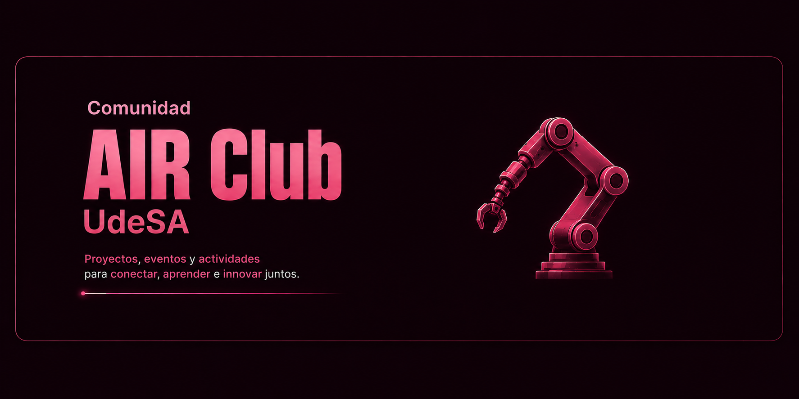

  

  <strong>Inteligencia artificial y robótica, en comunidad.</strong> 
  Somos estudiantes de la Universidad de San Andrés que nos juntamos a aprender, construir y compartir proyectos abiertos.

  <a href="https://clubroboticaudesa.netlify.app/"><strong>Sitio del club</strong></a>
  ·
  <a href="https://docs.google.com/forms/d/e/1FAIpQLSeJj7cS6SaCPaBr4a6dfJzeFF9W6BRWYxfLe0BEcGepSIvJBw/viewform"><strong>Sumate a la comunidad</strong></a>
  ·
  <a href="https://www.instagram.com/AIRClub_UdeSA"><strong>Instagram</strong></a>
  ·
  <a href="mailto:airclub@udesa.edu.ar"><strong>Contacto</strong></a>

## Construimos para aprender

El AIR Club es un espacio de colaboración entre estudiantes. Organizamos charlas, cursos, proyectos y competencias donde cada persona aporta lo suyo y todos aprendemos haciendo.

Trabajamos en la intersección entre inteligencia artificial y robótica: percepción, navegación autónoma, aprendizaje automático y software para robots móviles. Contamos con el acompañamiento de docentes del Departamento de Ingeniería de UdeSA.

## Challenge JAR 2026

Estamos organizando un desafío interuniversitario de comportamiento robótico para la Jornada Argentina de Robótica, que se realizará en Rosario del 3 al 6 de noviembre de 2026.

Todo el material de preparación es abierto:

| Proyecto | Qué encontrás |
| --- | --- |
| [`jar_site`](https://github.com/AIRclub-UdeSA/jar_site) | Sitio del desafío, guía de puesta a punto y workshops. |
| [`yahboom_rosmaster`](https://github.com/AIRclub-UdeSA/yahboom_rosmaster) | Simulador del ROSMASTER X3 para ROS 2 Humble y Gazebo Fortress. |
| [`jar_workshops`](https://github.com/AIRclub-UdeSA/jar_workshops) | Código de referencia y prácticas semanales para preparar el robot. |

**[Conocé el Challenge JAR 2026](https://airclub-udesa.github.io/jar_site/)**

## Más proyectos abiertos

- [`physical_rosmaster`](https://github.com/AIRclub-UdeSA/physical_rosmaster): integración y trabajo con el robot del club.
- [`yahboom_rosmaster_slam`](https://github.com/AIRclub-UdeSA/yahboom_rosmaster_slam): mapeo 2D con LiDAR y `slam_toolbox`.
- [`yahboom_rosmaster_teleop`](https://github.com/AIRclub-UdeSA/yahboom_rosmaster_teleop): teleoperación del ROSMASTER X3 con joystick.
- [`AIR-newsletter`](https://github.com/AIRclub-UdeSA/AIR-newsletter): curación automatizada de novedades de inteligencia artificial y robótica.

## Sumate

La Comunidad AIR está abierta a estudiantes con ganas de aprender; no necesitás experiencia previa. Completá el **[formulario de inscripción](https://docs.google.com/forms/d/e/1FAIpQLSeJj7cS6SaCPaBr4a6dfJzeFF9W6BRWYxfLe0BEcGepSIvJBw/viewform)** y contanos qué te gustaría hacer.

¿Querés proponer un proyecto, una charla o una colaboración? Escribinos a **[airclub@udesa.edu.ar](mailto:airclub@udesa.edu.ar)**. Si tu empresa quiere apoyar la robótica estudiantil, también podés **[contactar al club](mailto:airclub@udesa.edu.ar?subject=Sponsorship%20AIR%20Club%20UdeSA)**.
